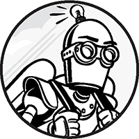

# chapter 1: UP AND RUNNING

We will make [console application] in our [development envirnment]

## The Structure of a Basic C++ Program

### Creating Your First C++ Source File
### Main: A C++ Program’s Starting Point
### Libraries: Pulling in External Code

## The Compiler Tool Chain

### Setting Up Your Development Environment
### Windows 10 and Later: Visual Studio
### macOS: Xcode
### Linux and GCC
### Text Editors

## Bootstrapping C++

### The C++ Type System
### Declaring Variables
### Initializing a Variable’s State
### Conditional Statements
### Functions
### printf Format Specifiers
### Revisiting step_function
### Comments

## Debugging
### Visual Studio
### Xcode
### GCC and Clang Debugging with GDB and LLDB

## Summary

[console application]: GLOSSARY.md#con
[development envirnment]: GLOSSARY.md#dev
